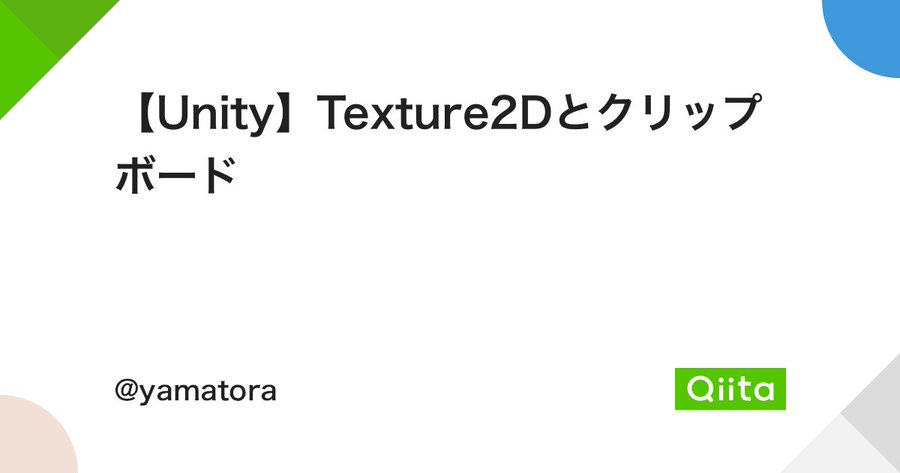

# yamatora. / やまとら｡

- **_Software Engineer_**
    - `C#`, `C++` etc.
    - `Visual Studio`, `Unity`
    - since 2018
- **_Night College Student_** (Information and Engineering)
    - Scheduled to graduate in March 2024

## Interest

- xR: VR, AR etc.
- Shader
- Kinematics

## Hobby

- Airsoft
- Self-made keyboard
- Concert
    - [Leo IEIRI](https://www.ymtr.jp/hobby#live)
- Game
    - Beat Saber
    - Mahjong Soul
    - Project SEKAI
    - FINAL FANTASY XIV

## Sports

- Baseball: 10 years
- Kyudo: 1 year

## Recent

<!-- 22/10/03:  【Unity】Texture2Dとクリップボード -->

    

